# UAS : PROJECT PROGRAM DATA MAHASISWA
| # | Biodata |
| -------- | --- |
| **Nama** | M. Hannata Zahri |
| **NIM** | 312010318 |
| **Kelas** | TI.22.A.4 |
| **Mata Kuliah** | Bahasa Pemrograman |
#

## DEMO PROJECT
### Soal UAS :
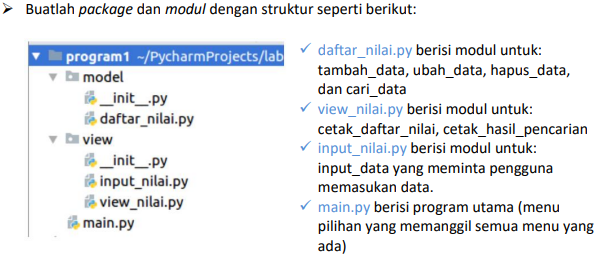
#

### Membuat Struktur *package* dan *module* :
* #### untuk folder **__pycache__** diabaikan saja, karena folder itu akan muncul sendiri ketika kita menjalankan program yang kita import.
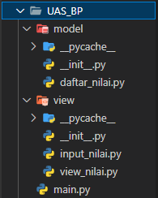
#

### Membuat program di module **daftar_nilai.py**
* #### Program ini berfungsi sebagai program CRUD (Create, Read, Update, Delete), akan tetapi di module ini kita hanya akan membuat program tambah/buat (Create), ubah (Update), dan hapus (Delete). Dan juga kita akan membuat program cari data di module ini.
* #### Masukan kode program berikut ke dalam file **daftar_nilai.py** :
```python
import view

dt_mhs = {}

# Menambah Data
def tambah_data():
    global dt_mhs
    ulangi = "y"
    while ulangi == "y":
        print("\n" + "Masukan data mahasiswa")
        print("="*25)
        nama = view.in_nama()
        nim = view.in_nim()
        nilai_tugas = view.in_Ntugas()
        nilai_uts = view.in_Nuts()
        nilai_uas = view.in_Nuas()
        nilai_akhir = nilai_akhir = (nilai_tugas)*30/100 + (nilai_uts)*35/100 + (nilai_uas)*35/100
        dt_mhs[nim] = [nama, nim, nilai_tugas, nilai_uts, nilai_uas, nilai_akhir]
        ulangi = (input('Ingin tambah data lagi? (y/n) : '))

        if ulangi == 'n':
            print("\n" + "Data berhasil di tambahkan!")
            return dt_mhs

# Mengubah data
def ubah_data():
    nim = input("\n" + "Masukan NIM untuk mengubah data: ")

    if nim in dt_mhs.keys():
        while True:
            print("\n" + "Mau mengubah apa?")
            update_dt = input("(Semua), (Nama), (Tugas), (UTS), (UAS) : ")
            if update_dt.lower() == "semua":
                print("\n")
                print(f"Ubah semua data dari NIM '{nim}'")
                print("="*40)
                dt_mhs[nim][0] = view.upd_nama()
                dt_mhs[nim][2] = view.upd_Ntugas()
                dt_mhs[nim][3] = view.upd_Nuts()
                dt_mhs[nim][4] = view.upd_Nuas()
                dt_mhs[nim][5] = dt_mhs[nim][2]*30/100 + dt_mhs[nim][3]*35/100 + dt_mhs[nim][4] *35/100
                print("\n" + "Data berhasil diubah!")
                break

            elif update_dt.lower() == "nama":
                print("\n")
                print(f"Ubah data 'Nama' dari NIM '{nim}'")
                print("="*40)
                dt_mhs[nim][0] = view.upd_nama()
                print("\n" + "Data <nama> berhasil diubah!")
                break

            elif update_dt.lower() == "tugas":
                print("\n")
                print(f"Ubah 'Nilai Tugas' dari NIM '{nim}'")
                print("="*40)
                dt_mhs[nim][2] = view.upd_Ntugas()
                dt_mhs[nim][5] = dt_mhs[nim][2] *30/100 + dt_mhs[nim][3]*35/100 + dt_mhs[nim][4] *35/100
                print("\n" + "Data <nilai tugas> berhasil diubah!")
                break

            elif update_dt.lower() == "uts":
                print("\n")
                print(f"Ubah 'Nilai UTS' dari NIM '{nim}'")
                print("="*40)
                dt_mhs[nim][3] = view.upd_Nuts()
                dt_mhs[nim][5] = dt_mhs[nim][2] *30/100 + dt_mhs[nim][3]*35/100 + dt_mhs[nim][4] *35/100
                print("\n" "Data <nilai UTS> berhasil diubah!")
                break

            elif update_dt.lower() == "uas":
                print("\n")
                print(f"Ubah 'Nilai UAS' dari NIM '{nim}'")
                print("="*40)
                dt_mhs[nim][4] = view.upd_Nuas()
                dt_mhs[nim][5] = dt_mhs[nim][2] *30/100 + dt_mhs[nim][3]*35/100 + dt_mhs[nim][4] *35/100
                print("\n" + "Data <nilai UAS> berhasil diubah!")
                break

            else:
                print("\n" + f"<Menu '{update_dt}' tidak ditemukan!>")

    else:
        print(f"NIM '{nim}' Tidak ditemukan!")

# Menghapus data
def hapus_data():
    print("Menghapus data...")
    print("="*40)
    nim = input("Masukan NIM untuk menghapus data : ")
    if nim in dt_mhs.keys():
        del dt_mhs[nim]
        print("\n" + f"Data NIM '{nim}' berhasil dihapus!")
    else:
        print("\n" + f"NIM '{nim}' Tidak ditemukan!")

# Mencari data
def cari_data():
    print("Mencari data...")
    print("="*40)
    view.mencari_data()
```
#

### Membuat program inputan di module **input_nilai.py**
* #### Setelah kita membuat program-program tertentu, sekarang kita membuat program untuk menerima masukan (input) dari pengguna (user). Alangkah baiknya program ini dibuat terlebih dahulu sebelum dibuatnya program-program lain.
* #### Masukan kode program berikut ke dalam file **input_nilai.py**:
```python
# Inputan Tambah Data
def in_nama() ->str:
    nama = input(f"{'Nama':<12}:")
    return nama

def in_nim() ->str:
    nim = input(f"{'NIM':<12}:")
    return nim

def in_Ntugas() ->int:
    nilai_tugas = int(input(f"{'Nilai Tugas':<12}:"))
    return nilai_tugas

def in_Nuts() ->int:
    nilai_uts = int(input(f"{'Nilai UTS':<12}:"))
    return nilai_uts

def in_Nuas() ->int:
    nilai_uas = int(input(f"{'Nilai UAS':<12}:"))
    return nilai_uas

# Inputan Ubah Data
def upd_nama() ->str:
    u_nama = input(f"{'Ubah Nama':<18}:")
    return u_nama

def upd_Ntugas() ->int:
    u_Ntugas = int(input(f"{'Ubah Nilai Tugas':18}:"))
    return u_Ntugas

def upd_Nuts() ->int:
    u_Nuts = int(input(f"{'Ubah Nilai UTS':18}:"))
    return u_Nuts

def upd_Nuas() ->int:
    u_Nuas = int(input(f"{'Ubah Nilai UAS':18}:"))
    return u_Nuas
```
#

### Membuat program *read* di dalam module **view_nilai.py**
* #### Module ini berfungsi sebagai program dari sisa CRUD yang belum dibuat sebelumnya, yaitu baca (Read). Dan juga sebagai program *read* untuk cetak hasil pencarian.
* #### Dan disini saya membuat beberapa template tampilan terminalnya. Supay ketika programnya dijalankan, tampilan terminalnya terlihat lebih friendly di mata user.
* #### Masukan kode program berikut ke dalam file **view_nilai.py** :
```python
import model

# PROGRAM UTAMA
## cetak_daftar_nilai
def lihat_data():
    print("Daftar Nilai:")
    print("="*67)
    print(f"|{'No':^4}|{'Nama':^20}|{'NIM':^11}|{'Tugas':^7}|{'UTS':^5}|{'UAS':^5}|{'Akhir':^7}|")
    print("="*67)
    if model.dt_mhs.keys():
        no = 1
        for tabel in model.dt_mhs.values():
            print(f"| {no:<3}| {tabel[0]:<19}| {tabel[1]:<10}| {tabel[2]:<6}| {tabel[3]:<4}| {tabel[4]:<4}| {tabel[5]:<6}|")
            print("-"*67)
            no += 1
    else:
        print(f"|{'!! TIDAK ADA DATA !!':^65}|")
        print("="*67)

## cetak_hasil_pencarian
def mencari_data():
    nim = input("Masukan NIM untuk mencari data: ")
    print("\n" + f"Result ({nim})")
    print("="*67)
    print(f"|{'Nama':^22}|{'*NIM':^13}|{'Tugas':^7}|{'UTS':^5}|{'UAS':^5}|{'Akhir':^7} |")
    print("="*67)
    if nim in model.dt_mhs.keys():
        print(f"| {model.dt_mhs[nim][0]:<21}| {model.dt_mhs[nim][1]:<12}| {model.dt_mhs[nim][2]:<6}| {model.dt_mhs[nim][3]:<4}| {model.dt_mhs[nim][4]:<4}| {model.dt_mhs[nim][5]:<6} |")
        print("-"*67)
    else:
        print(f"NIM '{nim}' Tidak ditemukan!")


# FUNCTION TAMBAHAN (template)
def template_op():
    print("="*67)
    print(f"|{'| PROGRAM INPUT NILAI MAHASISWA |':_^65}|")
    print("="*67)

def msg_salah():
    char1 = f"{'='*55}".center(67)
    tx_salah ="| Kesalahan memasukan perintah, Silahkan cek kembali! |".center(67)
    char2 = f"{'='*55}".center(67)
    print(char1)
    print(tx_salah)
    print(char2)

def template_end():
    char1 = f"{'='*55}".center(67)
    tx_end1 = "|-------------------PROGRAM SELESAI-------------------|".center(67)
    tx_end2 = "|-----TERIMA KASIH TELAH MENGGUNAKAN PROGRAM KAMI-----|".center(67)
    char2 = f"{'='*55}".center(67)

    print(char1)
    print(tx_end1)
    print(tx_end2)
    print(char2)
```
#

### Membuat program utama di dalam module **main.py**
* #### Dan untuk module ini adalah final dari semua program, yang di mana file ini berfungsi sebagai tempat kumpulan dari semua program yang di import dan sebagai module program yang akan kita jalankan.
* #### Masukan kode program berikut ke dalam file **main.py** :
```python
import os
import model
import view

os.system("cls")
view.template_op()

while True:
    print("\n")
    print("(L) Lihat, (T) Tambah, (H) Hapus, (U) Ubah, (C) Cari, (K) Keluar")
    menu = input("Pilih menu: ")
    print("\n")

    # Menu
    if menu.lower() == 't':
        os.system("cls")
        view.template_op()
        print("\n")
        model.tambah_data()

    elif menu.lower() == 'c':
        os.system("cls")
        view.template_op()
        print("\n")
        model.cari_data()

    elif menu.lower() == 'l':
        os.system("cls")
        view.template_op()
        print("\n")
        view.lihat_data()

    elif menu.lower() == 'u':
        os.system("cls")
        view.template_op()
        print("\n")
        model.ubah_data()

    elif menu.lower() == 'h':
        os.system("cls")
        view.template_op()
        print("\n")
        model.hapus_data()

    # Keluar
    elif menu.lower() == 'k':
        view.template_end()
        break

    # Kesalahan
    else:
        os.system("cls")
        view.template_op()
        print("\n")
        view.msg_salah()
```
#

### Penjelasan file `__init__.py`
* #### Di dalam dua package itu, terdapat sebuah file dari masing-masing package itu dengan format nama `__init__.py`. File itu berfungsi sebagai perantara untuk mengumpulkan dan memanggil module-module yang akan di import ke dalam module yang lain.
* #### Agar method `import`-nya berjalan, kita perlu melakukan pengumpulan data dengan cara memasukan beberapa kode program sebagai berikut (HARUS SESUAI DENGAN LOKASI FOLDER-NYA !!):
```python
# Untuk folder (model)
from . daftar_nilai import dt_mhs, tambah_data, ubah_data, hapus_data, cari_data
```
```python
# Untuk folder (view)
from . input_nilai import in_nama, in_nim, in_Ntugas, in_Nuts, in_Nuas, upd_nama, upd_Ntugas, upd_Nuts, upd_Nuas

from . view_nilai import lihat_data, mencari_data, template_op, template_end, msg_salah
```
#

### Output Program
* #### Output ketika awal program dijalankan :
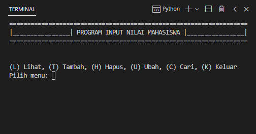
#

* #### Output dari program 'tambah/buat' data :
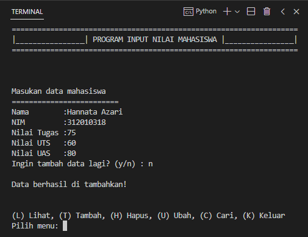
#


* #### Output dari program 'lihat/baca' data :
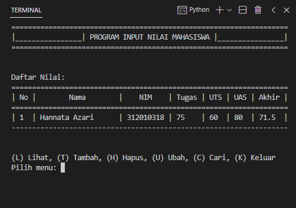
#

* #### Output dari program 'ubah' data :
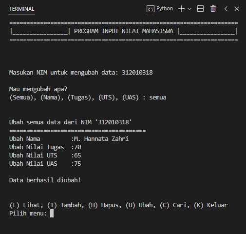
#

* #### Output dari program 'lihat/baca' setelah data diubah :
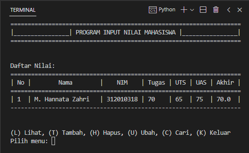
#

* #### Output dari program 'cari' data :
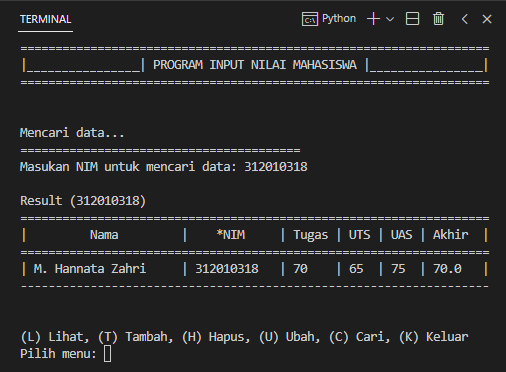
#

* #### Output dari program 'hapus' data :
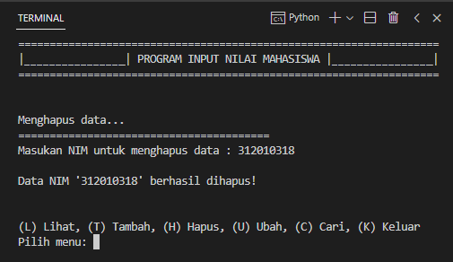
#

* #### Output dari program 'lihat/baca' setelah data dihapus, dan juga merupakan output program ketika data nilainya kosong :
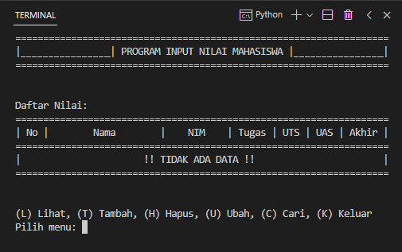
#

* #### Output dari program ketika user salah memasukan perintah :
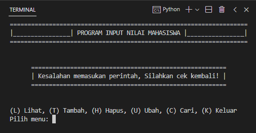
#

## Berikut beberapa Link URL :
* ### Link video You Tube : <https://youtu.be/XbRq43fz2x4>
* ### Link file PDF : <https://drive.google.com/file/d/15bVK1ENbTdYNF37O6UePLiJI8hULjj9Q/view?usp=sharing>
#

## SEKIAN DAN TERIMA KASIH :smile::smile: